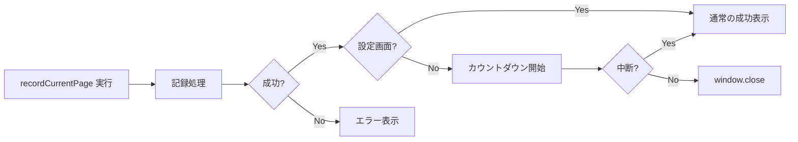

# UF-404: 記録成功後のポップアップ自動クローズ - TDD要件定義

## 概要

**【機能名】**: 記録成功後のポップアップ自動クローズ

**TDDタスクID**: UF-404

**作成日**: 2026-01-23

---

## 1. 機能の概要

### 信頼性レベル: 🟢 青信号

**ユーザーストーリー**:
> As a ユーザー,
> I want 記録成功後にポップアップが自動で閉じてくれること,
> So that 手動で閉じる手間を省き、素早く作業に戻れる

**何をする機能か**:
- 記録処理が成功した場合、メイン画面にいる時にのみ2秒後にポップアップを自動的に閉じる
- 設定画面にいる場合、またはエラーが発生した場合は自動クローズを行わない
- クローズ直前にカウントダウン表示を提供

**解決する問題**:
- 現状：記録成功後、ユーザーが手動でポップアップを閉じる必要がある
- 改善：自動クローズにより、ワンクリックで記録完了まで完結

**想定されるユーザー**:
- ページ閲覧中に素早く記録したいユーザー
- 記録後に即座に作業に戻りたいユーザー

**システム内での位置づけ**:
- 機能：Popup UI / ユーザー体験向上機能
- 影響範囲：`src/popup/main.js`、`src/popup/navigation.js`

**参照したTODO**: `plan/TODO.md` UF-404セクション

---

## 2. 入力・出力の仕様

### 信頼性レベル: 🟢 青信号

### 入力

| 入力名 | 型 | 説明 | 例 |
|--------|--------|------|-----|
| `result.success` | `boolean` | 記録処理の成功判定 | `true`, `false` |
| `screenState` | `'main' \| 'settings'` | 現在表示中の画面 | `'main'`, `'settings'` |

### 出力

| 出力名 | 型 | 説明 | 例 |
|--------|--------|------|-----|
| - | `void` | ポップアップの自動クローズ（副作用） | `window.close()` |

### 入出力の関係性

```
result.success === true AND screenState === 'main'
  → 2秒後に自動クローズ（カウントダウン表示あり）

result.success === false
  → 自動クローズなし（エラーメッセージ表示）

screenState === 'settings'
  → 自動クローズなし
```

### データフロー



### 参照した既存コード

- `src/popup/main.js:120-126` - 成功時の処理
- `src/popup/navigation.js:3-17` - 画面切り替えロジック

---

## 3. 制約条件

### 信頼性レベル: 🟢 青信号

### パフォーマンス要件
- **クローズ遅延時間**: 2,000ms ± 200ms
- **カウントダウン更新間隔**: 1,000ms

### UI/UX要件
- **カウントダウン表示**: ステータスエリアに「3...2...1...自動閉じる」を表示
- **中断可能性**: ユーザーが操作した場合はクローズをキャンセル
- **非表示**: 設定画面では成功メッセージのみ表示、カウントダウンなし

### 機能制約

| 制約項目 | 内容 | 理由 |
|----------|------|------|
| 画面依存 | メイン画面のみ自動クローズ | 設定作業中断を防ぐため |
| エラー除外 | エラー時は自動クローズしない | ユーザーに情報を見せるため |
| タイミング | 成功レスポンス受信後2秒 | ユーザーが成功を確認できる時間 |

### ブラウザAPI制約
- `window.close()` は、スクリプトで開いたウィンドウでのみ動作が保証される
- Chrome Extensionポップアップは通常 `window.close()` 可能

### 参照した設計

- `plan/TODO.md` UF-404セクション

---

## 4. 想定される使用例

### 信頼性レベル: 🟢 青信号

### 基本的な使用パターン（正常系）

#### 略電1: メイン画面での記録成功
**状態**:
- ユーザーはメイン画面で「今すぐ記録」ボタンをクリック
- 記録処理が成功

**期待挙動**:
1. `✓ Obsidianに保存しました` が表示される
2. ステータスエリアに `3...2...自動閉じる` がカウントダウン表示され更新される
3. 2秒後にポップアップが閉じる

#### 略電2: 設定画面での記録成功
**状態**:
- ユーザーは設定画面を開いている状態で、何らかの理由で記録処理が成功

**期待挙動**:
1. `✓ Obsidianに保存しました` が表示される
2. カウントダウン表示なし
3. ポップアップは開いたまま

#### 略電3: 記録失敗
**状態**:
- 記録処理が失敗（エラー発生）

**期待挙動**:
1. `✗ エラー: [エラーメッセージ]` が表示される
2. カウントダウン表示なし
3. ポップアップは開いたまま

### エッジケース

#### EDGE-001: 連続記録
**状況**: ユーザーがクローズ待ち中に再度記録ボタンをクリック

**期待挙動**:
- 新しい記録処理が開始される
- 前のクローズタイマーはキャンセルされる

#### EDGE-002: カウントダウン中の画面遷移
**状況**: カウントダウン中に「設定」ボタンをクリック

**期待挙動**:
- クローズタイマーがキャンセルされる
- 設定画面が表示される

#### EDGE-003: クローズ失敗
**状況**: `window.close()` がブラウザによってブロックされる

**期待挙動**:
- エラーはスローしない（サイレントフェール）
- ポップアップは開いたまま

### エラーケース

| エラー | 対応 | ユーザーへの影響 |
|--------|------|------------------|
| タイマーのクリアに失敗 | 無視 | 次の記録で新しいタイマーが上書き |
| `window.close()` 失敗 | 無視 | ポップアップは開いたまま |

### 参照したTODO

- `plan/TODO.md` UF-404テストケースセクション

---

## 5. EARS要件・設計文書との対応関係

### 参照したTODO・文書

- **TODO文書**: `plan/TODO.md`
  - UF-404セクション（記録成功後のポップアップ自動クローズ）
- **既存コード**:
  - `src/popup/main.js`: 記録処理ロジック
  - `src/popup/navigation.js`: 画面切り替えロジック

### 要件対応表

| TODO項目 | 要件カテゴリ | 対応内容 |
|----------|--------------|----------|
| 記録成功後にクローズロジック追加 | 機能要件 | `result.success` 時にタイマー起動 |
| `setTimeout(..., 2000)` 実装 | 非機能要件 | 2秒遅延 |
| 設定画面にいる場合はクローズしない | 機能要件 | 画面状態チェック |
| `isOnSettingsScreen` 状態変数追加 | データ設計 | 画面状態追跡 |
| カウントダウン秒数の表示 | UI要件 | 3...2...クローズ表示 |
| 「自動閉じる」アラートの表示 | UI要件 | ステータスエリアへのメッセージ |

---

## 6. 実装優先度と判断基準

### 必須実装（MUST）

1. **自動クローズロジック**
   - 記録成功時にタイマーを起動
   - 2秒後に `window.close()` 実行

2. **画面状態チェック**
   - 設定画面では自動クローズしない
   - `navigation.js` に画面状態追跡を追加

3. **エラー時除外**
   - エラー発生時は自動クローズしない

### 推奨実装（SHOULD）

4. **カウントダウン表示**
   - ユーザーにクローズ準備を通知
   - 3...2...1...の形式

5. **タイマークリア**
   - 画面遷移時や連続記録でタイマーをキャンセル

### オプション（MAYBE）

6. **設定保存機能**
   - ユーザーが自動クローズをオフにできる設定

---

## 7. 未決定事項・懸念点

| 項目 | 内容 | 判断基準 |
|------|------|----------|
| カウントダウン秒数 | 現状2秒固定 | ユーザーフィードバック次第で調整 |
| 設定による無効化 | 現状未実装 | 要望があれば今後対応 |
| クローズ失敗時の通知 | 現状サイレントフェール | 必要性を検討 |

---

## 8. テスト戦略

### テスト可能な単位

1. **単体テスト（Jest）**
   - `navigation.js`: 画面状態追跡のテスト
   - タイマー管理ロジックのテスト

2. **統合テスト**
   - 記録成功 → 設定画面 → 設定画面ではクローズしない
   - 記録失敗 → クローズしない

3. **E2Eテスト（Playwright）**
   - 受け入れテストシナリオ

### テスト不可・検証困難な項目

- `window.close()` の実際の動作（ブラウザ依存）
  - ⇒ ログ出力とタイマー値で間接検証

---

## 品質判定結果

### ✅ 高品質

- **要件の曖昧さ**: なし
- **入出力定義**: 完全
- **制約条件**: 明確
- **実装可能性**: 確実

### 判定理由
- TODO.mdからの要件抽出が完了
- 既存コード（main.js、navigation.js）を参照し、影響範囲が明確
- 正常系・エッジケース・エラーケースが網羅されている
- 実装優先度が定義されている

---

## 次のステップ

**推奨コマンド**: `/tdd-testcases` でテストケースの洗い出しを行います。

テストケースでは以下を網羅します：
1. メイン画面での成功時自動クローズ
2. 設定画面での成功時クローズなし
3. エラー時のクローズなし
4. 連続記録のタイマー管理
5. 画面遷移中のタイマーキャンセル