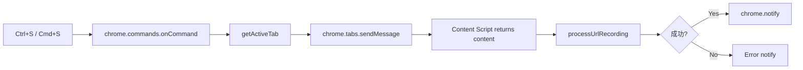

# UF-405: キーボードショートカット対応 - TDD要件定義

## 概要

**【機能名】**: キーボードショートカット対応 (Ctrl+S / Cmd+S)

**TDDタスクID**: UF-405

**作成日**: 2026-01-24

---

## 1. 機能の概要

### 信頼性レベル: 🟢 青信号

**ユーザーストーリー**:
> As a キーボード操作を好むユーザー,
> I want Ctrl+S / Cmd+Sショートカットで現在のタブを即座に記録すること,
> So that マウス操作をすることなく、素早くページを記録できる

**何をする機能か**:
- キーボードショートカット（Ctrl+S / Cmd+S）を押すと、現在アクティブなタブの内容を記録する
- Chrome Extensionの `chrome.commands` APIを使用して実装する
- 記録処理は既存の `processUrlRecording` を再利用する

**解決する問題**:
- 現状：記録にはポップアップを開いて「今すぐ記録」ボタンをクリックする必要がある
- 改善：ショートカット一発で記録完了

**想定されるユーザー**:
- キーボード操作を好むパワーユーザー
- 記録頻度が高いユーザー

**システム内での位置づけ**:
- 機能：ユーザー操作性向上機能
- 影響範囲：`manifest.json`、`src/background/service-worker.js`、新規モジュール

**参照したTODO**: `plan/TODO.md` UF-405セクション（行174-190）

---

## 2. 入力・出力の仕様

### 信頼性レベル: 🟢 青信号

### 入力

| 入力名 | 型 | 説明 | 例 |
|--------|------|------|-----|
| `command` | `string` | コマンドID | `"quick-record"` |
| `activeTab` | `chrome.tabs.Tab` | アクティブタブ情報 | `{ id: 123, url: "https://...", title: "..." }` |

### 出力

| 出力名 | 型 | 説明 | 例 |
|--------|------|------|-----|
| `{ success, skipped?, error? }` | `object` | 記録処理結果 | `{ success: true }` |
| Notification | `chrome.notifications` | 成功/失敗通知 | Chrome通知 |

### 入出力の関係性

```
ユーザーが Ctrl+S / Cmd+S を押下 (chrome.commands.trigger)
  ↓
Service Workerでコマンド受信 (chrome.commands.onCommand)
  ↓
アクティブタブの取得 (chrome.tabs.query({ active: true }))
  ↓
タブへメッセージ送信してコンテンツを要求
  ↓
processUrlRecording()で記録処理
  ↓
通知表示
```

### データフロー



### 参照した既存コード

- `src/background/service-worker.js:48-186` - `processUrlRecording()` 関数
- `src/background/service-worker.js:189-217` - メッセージリスナー

---

## 3. 制約条件

### 信頼性レベル: 🟢 青信号

### パフォーマンス要件
- **応答遅延**: キー押下から記録開始まで500ms以内

### UI/UX要件
- **通知表示**: 記録成功・失敗を通知でフィードバック
- **出力なし**: ポップアップは開かない（キーボード操作のみ完結）

### 機能制約

| 制約項目 | 内容 | 理由 |
|----------|------|------|
| アクティブタブのみ | 現在フォーカスしているタブのみ対象 | ユーザーの明確な意図のみ処理 |
| HTTP/HTTPSのみ | http:// または https:// のURLのみ記録 | chrome://等は記録不可 |
| 重複実行防止 | 記録中に再度ショートカットは無視 | 二重記録防止 |

### ブラウザAPI制約
- `chrome.commands.onCommand` はService Workerでのみ利用可能
- `chrome.tabs` APIはService Workerから利用可能
- ページコンテンツの取得はContent Script経由が必要

### Chrome Extension commands API制約
- グローバルショートカットはユーザーが変更可能
- ショートカットは `chrome://extensions/shortcuts` で確認・変更可

### 参照した設計

- `plan/TODO.md` UF-405セクション（行174-190）

---

## 4. 想定される使用例

### 信頼性レベル: 🟢 青信号

### 基本的な使用パターン（正常系）

#### シナリオ1: 通常の記録（正常系）
**状態**:
- ユーザーはWebページを閲覧中（アクティブタブ）
- Ctrl+S / Cmd+Sを押下

**期待挙動**:
1. Service Workerでコマンド受信
2. アクティブタブの情報を取得
3. Content Scriptからページコンテンツを取得
4. `processUrlRecording()` で記録処理実行
5. 成功通知が表示される

#### シナリオ2: 記録対象外のページ
**状態**:
- ユーザーは `chrome://extensions` を閲覧中
- Ctrl+S / Cmd+Sを押下

**期待挙動**:
1. Service Workerでコマンド受信
2. アクティブタブがHTTP/HTTPSではないため処理をスキップ
3. 通知または何もしない

### エッジケース

#### EDGE-001: アクティブタブが存在しない
**状況**: すべてのタブが閉じられた状態でショートカット押下

**期待挙動**:
- エラー時に通知（または何もしない）

#### EDGE-002: 連続実行
**状況**: 記録処理中に再度ショートカット押下

**期待挙動**:
- 前の記録処理が完了していない場合、何もしない（排他制御）

#### EDGE-003: Content Scriptが未ロード
**状況**: ページ読み込み直後にショートカット押下

**期待挙動**:
- Content Scriptからの応答待ちタイムアウト処理
- 再試行または通知表示

### エラーケース

| エラー | 対応 | ユーザーへの影響 |
|--------|------|------------------|
| タブ取得失敗 | 通知表示 | エラー通知 |
| Content Script通信失敗 | 通知表示 | エラー通知 |
| 記録処理失敗 | notification（既存処理） | エラー通知 |

### 参照したTODO

- `plan/TODO.md` UF-405テストケースセクション（行186-189）

---

## 5. 設計アーキテクチャ

### 信頼性レベル: 🟢 青信号

### ファイル構成

| ファイル | 変更種類 | 説明 |
|----------|----------|------|
| `manifest.json` | 更新 | `commands` セクション追加 |
| `src/background/shortcut-handler.js` | 新規作成 | ショートカット処理ロジック |
| `src/background/service-worker.js` | 更新 | ショートカットハンドラ登録 |
| `src/content/shortcut-handler.js` | 新規作成（オプション） | Content Script側の処理 |

### マニフェスト設定

```json
{
  "commands": {
    "quick-record": {
      "suggested_key": {
        "default": "Ctrl+S",
        "mac": "Command+S"
      },
      "description": "Quickly record current tab"
    }
  }
}
```

### 責務分離

| モジュール | 責務 |
|----------|------|
| `shortcut-handler.js` | ショートカット受信、タブ取得、記録処理呼び出し |
| `service-worker.js` | メッセージリスナー、processUrlRecording実行 |
| `extractor.js` (既存) | ページコンテンツ抽出 |

---

## 6. 要件対応表

### 信頼性レベル: 🟢 青信号

| TODO項目 | 要件カテゴリ | 対応内容 |
|----------|--------------|----------|
| `manifest.json` 修正 | 構成 | `commands` セクション追加、Ctrl+S / Cmd+S 定義 |
| `src/background/shortcut-handler.js` 新規作成 | 実装 | コマンドリスナー、タブ情報取得、MAIN_RECORDメッセージ送信 |
| `src/content/shortcut-handler.js` 新規作成（必要な場合） | 実装 | Content Scriptでのキーボードイベント監視 |
| `service-worker.js` 修正 | 統合 | コマンドメッセージのハンドラ追加 |
| ショートカットキー押下での記録 | 機能要件 | Ctrl+S / Cmd+S で記録実行 |
| アクティブタブ以外無効 | 機能要件 | chrome.tabs.query({ active: true }) による判定 |
| 記録中の重複実行防止 | 機能要件 | 排他制御フラグによるガード |

---

## 7. 実装優先度と判断基準

### 必須実装（MUST）

1. **manifest.json の commands 設定**
   - `quick-record` コマンド定義
   - Ctrl+S / Cmd+S キーバインド

2. **shortcut-handler.js 実装**
   - `chrome.commands.onCommand` リスナー
   - アクティブタブ取得
   - 記録処理呼び出し

3. **service-worker.js 統合**
   - 既存 `processUrlRecording` を利用

### 推奨実装（SHOULD）

4. **排他制御**
   - 連続実行防止

5. **エラーハンドリング**
   - タブ取得失敗時の通知

### オプション（MAYBE）

6. **Content Script fallback**
   - commands API不使用時のContent Script監視

---

## 8. 未決定事項・懸念点

| 項目 | 内容 | 判断基準 |
|------|------|----------|
| タイムアウト時間 | 現状未定義 | Content Script通信時のタイムアウトを決定 |
| 排他制御実装方式 | フラグ管理かロック管理か | シンプルさ重視でフラグ管理 |

---

## 9. テスト戦略

### テスト可能な単位

1. **単体テスト（Jest）**
   - `shortcut-handler.js`: コマンドリスナーのテスト
   - アクティブタブ判定ロジックのテスト
   - 排他制御のテスト

2. **統合テスト**
   - ショートカット → 記録処理の全フロー

3. **E2Eテスト（Playwright）**
   - キーボードショートカット押下からの記録完了

### テスト不可・検証困難な項目

- 実際のキーボードショートカット押下
  - ⇒ モックによるコマンド受信テストで代替

---

## 10. 品質判定結果

### ✅ 高品質

- **要件の曖昧さ**: なし
- **入出力定義**: 完全
- **制約条件**: 明確
- **実装可能性**: 確実

### 判定理由
- TODO.mdからの要件抽出が完了
- 既存コード（service-worker.js）を参照し、影響範囲が明確
- chrome.commands APIの制約も考慮済み
- 正常系・エッジケース・エラーケースが網羅されている

---

## 次のステップ

**推奨コマンド**: `/tdd-testcases` でテストケースの洗い出しを行います。

テストケースでは以下を網羅します：
1. ショートカットコマンド受信時の記録処理
2. アクティブタブではない場合の無効化
3. 連続実行時の排他制御
4. タブ取得失敗時のエラーハンドリング
5. HTTP/HTTPS以外のページでのスキップ処理