# PII Sanitizing 仕様書 v2

**最終更新:** 2026-01-21

## 実装ステータス

| Phase | ステータス | 完了日 |
|-------|-----------|--------|
| Phase 1: ローカルAI要約クライアント (L1) | ✅ 完了 | 実装済み |
| Phase 2: 正規表現サニタイザー (L2) | ✅ 完了 | 実装済み |
| Phase 3: モード選択UI・設定保存 | ✅ 完了 | 実装済み |
| Phase 4: ユーザー確認UI | ✅ 完了 | 実装済み |
| Phase 5: ログ機能 + 7日保持 | ✅ 完了 | 実装済み |
| Phase 6: テスト・調整 | ✅ 完了 | 検証済み |

**全体進捗**: 100% (6/6フェーズ完了)

---

## 概要

WebページをObsidianに記録する際、ローカルAIによる要約と、PII（個人情報）マスキング機能を追加する。ユーザーの好みに応じて4つの動作モードを選択可能にする。

---

## 1. アーキテクチャ：3つの処理レイヤー

| レイヤー | 名称 | 処理内容 | 必要条件 |
|----------|------|----------|----------|
| **L1** | ローカル要約 | `window.ai`で1行要約を生成 | Edge/Chrome内蔵AI |
| **L2** | PIIマスキング | 正規表現 + LLM補助で機密情報をマスク | — |
| **L3** | クラウド要約 | 既存`aiClient.js`で高品質要約 | API Key |

---

## 2. 4つの動作モード

```
┌─────────────────────────────────────────────────────────────────┐
│  Mode A: Local Only          [L1のみ]                          │
│  ─────────────────────────────────────────────────────────────  │
│  ページ → ローカルAI要約 → Obsidianに保存                     │
│  ※ プライバシー最優先。外部通信なし                           │
├─────────────────────────────────────────────────────────────────┤
│  Mode B: Full Pipeline       [L1 → L2 → L3]                    │
│  ─────────────────────────────────────────────────────────────  │
│  ページ → ローカル要約 → PIIマスク → クラウド要約 → 保存     │
│  ※ 最も安全に高品質な要約を取得                               │
├─────────────────────────────────────────────────────────────────┤
│  Mode C: Masked Cloud        [L2 → L3]（L1なし時自動適用）      │
│  ─────────────────────────────────────────────────────────────  │
│  ページ → PIIマスク（Regexのみ） → クラウド要約 → 保存        │
│  ※ Firefox等、window.ai非対応ブラウザ用                       │
├─────────────────────────────────────────────────────────────────┤
│  Mode D: Cloud Only          [L3のみ]（現行動作）               │
│  ─────────────────────────────────────────────────────────────  │
│  ページ → クラウド要約 → 保存                                  │
│  ※ 既存動作。速度優先・PII保護なし                            │
└─────────────────────────────────────────────────────────────────┘
```

### デフォルト動作
- **Edge/Chrome（window.ai対応）:** Mode B
- **Firefox等（非対応）:** Mode C
- ユーザーは設定画面でモードを変更可能

---

## 3. 保護対象の優先順位 (L2: PIIマスキング)

| 優先度 | 情報種別 | 検出方法 |
|--------|----------|----------|
| **High** | クレジットカード番号 | 正規表現（Luhn検証付き） |
| **High** | マイナンバー（12桁） | 正規表現 |
| **High** | 銀行口座番号 | 正規表現 |
| **High** | パスワード（フォーム入力） | DOM属性検出 + 正規表現 |
| Medium | メールアドレス | 正規表現 |
| Medium | 電話番号（日本形式） | 正規表現 |
| Low | 人名 | ローカルLLM判定のみ |
| Low | 住所 | ローカルLLM判定のみ |

> **設計指針:** 「1行に要約する」目的において、機密情報は不要。積極的にマスキングする。

---

## 4. PIIフォールバック戦略 (L2内)

| Level | 条件 | 処理内容 | 安全性 |
|-------|------|----------|--------|
| **Level 1** | 内蔵AI（`window.ai`）利用可能 | LLMで文脈判断 + 正規表現で高優先度情報をマスク | **最高** |
| **Level 2** | AI未搭載・ダウンロード中 | 正規表現のみで高優先度情報をマスク | **高** |
| **Level 3** | クレンジング失敗 | 送信キャンセル。ユーザーに通知 | **絶対** |

---

## 5. ユーザー確認UI

### MVP仕様
- マスキング後のテキストをプレビュー表示
- `[MASKED]`箇所をハイライト（元テキストとの差分表示）
- 「送信」「キャンセル」「編集」ボタン

### 将来オプション
- 「確認なしで送信」設定（上級ユーザー向け）
- チェックボックスで有効化

---

## 6. ログ機能

### 保存対象
- タイムスタンプ
- マスキング結果（件数・種別）
- 送信成否
- ※ 生テキストは**保存しない**

### 保持期間
- 直近7日間
- 8日目以降は自動削除

### ストレージ
- `chrome.storage.local`に保存
- キー: `pii_sanitize_logs`

---

## 6. 技術設計

### 新規ファイル（実装済み）

**✅ 完了**

```
src/
├── background/
│   └── localAiClient.js   # ✅ L1: ローカルAI要約クライアント
├── utils/
│   └── piiSanitizer.js    # ✅ L2: PIIマスキングサービス
│   └── logger.js          # ✅ ログ機能
├── popup/
│   └── sanitizePreview.js # ✅ ユーザー確認UI
└── offscreen/
    └── offscreen.html     # ✅ Offscreen Document
    └── offscreen.js       # ✅ Chrome Prompt API ハンドラー
```

### 既存ファイルの変更（実装済み）

**✅ 完了**

| ファイル | 変更内容 | ステータス |
|----------|----------|----------|
| `service-worker.js` | `processUrlRecording()`内でモード判定・各レイヤー呼び出し | ✅ 完了 |
| `storage.js` | 動作モード設定キー、ログ管理用キーを追加 | ✅ 完了 |
| `popup.html` | モード選択UI、確認UIセクションを追加 | ✅ 完了 |
| `popup.js` | main.js経由でモード切替ロジック実装 | ✅ 完了 |

---

## 8. 正規表現パターン（L2用）

```javascript
const PII_PATTERNS = {
  // クレジットカード（16桁、スペース・ハイフン許容）
  creditCard: /\b(?:\d{4}[-\s]?){3}\d{4}\b/g,
  
  // マイナンバー（12桁）
  myNumber: /\b\d{4}[-\s]?\d{4}[-\s]?\d{4}\b/g,
  
  // 銀行口座（7桁）
  bankAccount: /\b\d{7}\b/g,
  
  // メールアドレス
  email: /[a-zA-Z0-9._%+-]+@[a-zA-Z0-9.-]+\.[a-zA-Z]{2,}/g,
  
  // 電話番号（日本形式）
  phoneJp: /\b0\d{1,4}[-\s]?\d{1,4}[-\s]?\d{4}\b/g,
};
```

---

## 9. ローカルAI（window.ai）— L1要約 & L2補助

### 対応ブラウザ
- **Edge** (優先) — Phi-4-mini
- **Chrome** — Gemini Nano

### 初期化コード

```javascript
async function initLocalAI() {
  const capabilities = await window.ai?.languageModel?.capabilities();
  
  if (capabilities?.available === 'readily') {
    return await window.ai.languageModel.create({
      systemPrompt: `You are a privacy filter. 
        Identify and replace sensitive information with [MASKED].
        Sensitive info includes: names, addresses, emails, phone numbers.
        Keep all other text exactly as is.`
    });
  }
  return null; // Fallback to Level 2
}
```

---

## 10. 処理フロー

```mermaid
flowchart TD
    A[ページコンテンツ取得] --> MODE{動作モード?}
    
    MODE -- Mode A --> L1A[L1: ローカルAI要約]
    L1A --> SAVE[Obsidianに保存]
    
    MODE -- Mode B --> L1B[L1: ローカルAI要約]
    L1B --> L2B[L2: PIIマスク]
    L2B --> CONFIRM{ユーザー確認UI}
    CONFIRM -- 送信 --> L3B[L3: クラウド要約]
    CONFIRM -- キャンセル --> CANCEL[処理中止]
    L3B --> SAVE
    
    MODE -- Mode C --> L2C[L2: PIIマスク Regexのみ]
    L2C --> CONFIRM
    
    MODE -- Mode D --> L3D[L3: クラウド要約]
    L3D --> SAVE
    
    SAVE --> LOG[ログ記録]
    CANCEL --> LOG
    LOG --> END[完了]
```



---

## 11. 将来拡張 (TODO)

| 機能 | 優先度 | 備考 | ステータス |
|------|--------|------|----------|
| ログビューアUI | Low | 現時点では不要。将来検討 | 📋 未着手 |
| ログエクスポート機能 | Low | JSON形式でのエクスポート | 📋 未着手 |

### 決定事項
- **window.ai非対応ブラウザ（Firefox等）** → Mode C（L2→L3）で動作

---

## 12. 実装フェーズ（案）

| Phase | 内容 | 工数目安 | ステータス |
|-------|------|----------|----------|
| Phase 1 | ローカルAI要約クライアント（L1） | 2時間 | ✅ 完了 |
| Phase 2 | 正規表現サニタイザー（L2） | 1-2時間 | ✅ 完了 |
| Phase 3 | モード選択UI・設定保存 | 1-2時間 | ✅ 完了 |
| Phase 4 | ユーザー確認UI | 2-3時間 | ✅ 完了 |
| Phase 5 | ログ機能 + 7日保持 | 1時間 | ✅ 完了 |
| Phase 6 | テスト・調整 | 1-2時間 | ✅ 完了 |

---

## 付録: 既存コードとの統合ポイント

### storage.js への追加

```javascript
export const StorageKeys = {
  // 既存のキー...
  
  // PII Sanitizing 関連
  PRIVACY_MODE: 'privacy_mode',           // 'local_only' | 'full_pipeline' | 'masked_cloud' | 'cloud_only'
  PII_CONFIRMATION_UI: 'pii_confirmation_ui', // true | false
  PII_SANITIZE_LOGS: 'pii_sanitize_logs',
};

const DEFAULT_SETTINGS = {
  // 既存のデフォルト...
  
  [StorageKeys.PRIVACY_MODE]: 'full_pipeline', // Mode B がデフォルト
  [StorageKeys.PII_CONFIRMATION_UI]: true,
};
```

### service-worker.js processUrlRecording() 統合

```javascript
async function processUrlRecording(data) {
  const { title, url, content, force = false } = data;
  const settings = await getSettings();
  const mode = settings[StorageKeys.PRIVACY_MODE];
  
  let summary = "Summary not available.";
  
  if (content) {
    switch (mode) {
      case 'local_only':       // Mode A
        summary = await localAiClient.summarize(content);
        break;
        
      case 'full_pipeline':    // Mode B
        const localSummary = await localAiClient.summarize(content);
        const sanitized = await piiSanitizer.sanitize(localSummary);
        if (!await confirmWithUser(sanitized)) return { cancelled: true };
        summary = await aiClient.generateSummary(sanitized.text);
        break;
        
      case 'masked_cloud':     // Mode C
        const sanitizedC = await piiSanitizer.sanitizeRegexOnly(content);
        if (!await confirmWithUser(sanitizedC)) return { cancelled: true };
        summary = await aiClient.generateSummary(sanitizedC.text);
        break;
        
      case 'cloud_only':       // Mode D (既存動作)
      default:
        summary = await aiClient.generateSummary(content);
        break;
    }
  }
  
  // 既存の保存処理...
}
```
