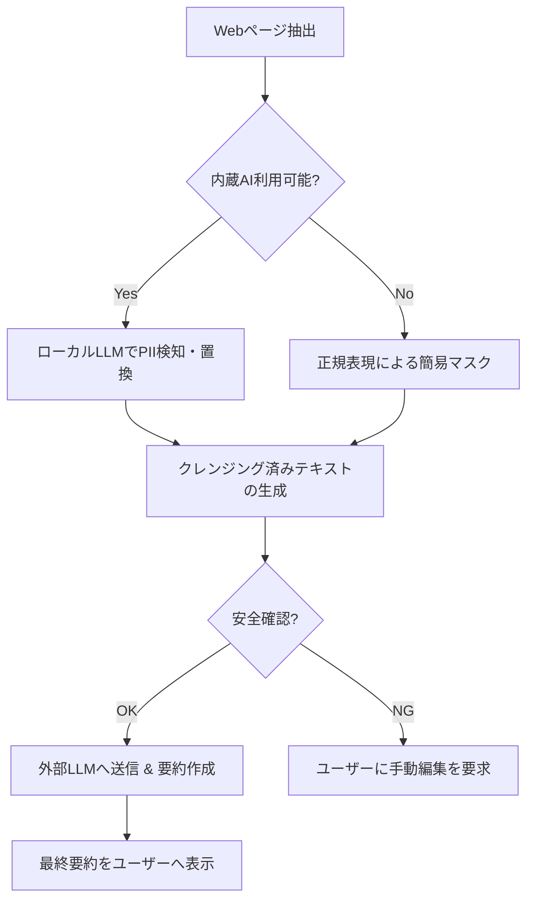

# PII Sanitizing

セキュリティの堅牢性とブラウザ間の互換性に深く踏み込んだ、より実戦的なレポート構成案を作成しました。

---

# Webページ要約拡張機能における高度なプライバシー保護とマルチブラウザ対応戦略

## 1. コア・コンセプト：Hybrid Privacy Pipeline

本プロジェクトでは、**「ローカルでの高度な匿名化（Local PII Sanitization）」**と**「クラウドでの高品質な要約（Cloud High-end Summarization）」**を分離したハイブリッド構成を採用します。これにより、生データ（Raw Data）がデバイス外に流出することを構造的に防ぎます。

---

## 2. 具体的なセキュリティポリシー案

ユーザーの信頼を獲得し、コンプライアンスを遵守するための「データ取り扱い原則」を以下のように定義します。

* **Zero-Raw-Data Transmission:** ユーザーの生テキストは、いかなる場合も直接外部サーバーへ送信しない。
* **Local-First Processing:** 個人情報の検知・置換処理は、必ずユーザーのローカル環境（デバイス上）で完結させる。
* **Minimal Data Retention:** 拡張機能内でのテキスト保持は揮発性メモリ上のみとし、処理完了後は即座に破棄する。
* **Transparency:** どの情報が「個人情報」としてマスクされたかを、要約結果とともにユーザーに明示する。

---

## 3. Edge / Chrome 包括的対応（Cross-browser Strategy）

2026年現在、Chromiumベースの主要ブラウザは **WICG標準の Prompt API (`window.ai`)** に準拠しています。以下の戦略で両ブラウザに対応します。

### 実装アプローチ

* **共通インターフェースの利用:** `window.ai.languageModel` をエントリーポイントとし、ブラウザごとの内蔵モデル（Gemini Nano / Phi-4-mini）の違いをラップして隠蔽します。
* **モデル特性の最適化:**
* **Chrome:** 推論速度に優れたGemini Nanoを優先。
* **Edge:** 論理的推論に定評のあるPhiモデルを活用。


* **Feature Detection:** 特定のブラウザ判定ではなく、「APIの有無」と「モデルの準備状況」に基づく動的な機能有効化。

---

## 4. 堅牢なエラーハンドリング・戦略

ローカルAIが利用できない、あるいは処理に失敗した場合に備え、3段階のフォールバック層を設けます。

| 階層 | シナリオ | 動作内容 | 安全性 |
| --- | --- | --- | --- |
| **Level 1 (Optimal)** | 内蔵AIが正常動作 | ローカルLLMで文脈を読み、人名や住所を `[PROTECTED]` に置換。 | **最高** |
| **Level 2 (Fallback)** | AI未搭載・DL中 | 高度な正規表現（Regex）とヒューリスティックによる、メール・電話番号・URL等の定型情報の強制マスク。 | **高** |
| **Level 3 (Safe-Stop)** | クレンジング失敗 | 「プライバシー保護を完了できませんでした」と表示し、外部送信を中断。ユーザーに手動確認を促す。 | **絶対** |

---

## 5. 技術実装のワークフロー（詳細版）



### Edgeブラウザ等での共通初期化コード例

```javascript
async function initializeLocalAI() {
  const capabilities = await window.ai?.languageModel?.capabilities();
  
  if (capabilities?.available === 'readily') {
    return await window.ai.languageModel.create({
      systemPrompt: "You are a PII filter. Replace names, addresses, and emails with [MASK]."
    });
  } else if (capabilities?.available === 'after-download') {
    // モデルのダウンロードを促すか、バックグラウンドで開始
    console.warn("AI model downloading...");
  }
  return null; // フォールバック層へ
}

```

---

## 5. いったんのサマリー

**コンセプト:** 「ローカルで守り、クラウドで賢く要約する」ハイブリッド型AIアーキテクチャ

### 解決する課題

Webページの要約において、ブラウザ上の個人情報（名前、住所、連絡先等）が外部LLMサーバーに送信されるプライバシーリスク。

### 技術的解決策

1. **Local Sanitization:** Chrome/Edgeに内蔵された小型モデル（Gemini Nano / Phi）を利用し、デバイス内で個人情報を検知・マスキング（[MASK]化）する。
2. **Cross-Browser Support:** WICG標準の `window.ai` (Prompt API) を採用し、同一コードで主要ブラウザの内蔵AIを制御。
3. **Secure Flow:** マスキング後の「安全なテキスト」のみを外部LLM（GPT-4/Gemini Pro等）に送信。

---

## 6. 具体的なコードベース (React / TypeScript)

拡張機能のポップアップまたはサイドパネルでの利用を想定した実装案です。

### A. 型定義 (`types.ts`)

```typescript
export type AIStatus = 'readily' | 'after-download' | 'no' | 'unsupported';

export interface PIIFilterResult {
  safeText: string;
  isSanitized: boolean;
  error?: string;
}

```

### B. 内蔵AI管理用カスタムフック (`useBuiltInAI.ts`)

```typescript
import { useState, useEffect } from 'react';

export const useBuiltInAI = () => {
  const [status, setStatus] = useState<AIStatus>('unsupported');

  useEffect(() => {
    const checkCapabilities = async () => {
      if (!window.ai?.languageModel) {
        setStatus('unsupported');
        return;
      }
      const capabilities = await window.ai.languageModel.capabilities();
      setStatus(capabilities.available);
    };
    checkCapabilities();
  }, []);

  const createSession = async (systemPrompt: string) => {
    if (status !== 'readily') throw new Error('AI Model not ready');
    return await window.ai.languageModel.create({ systemPrompt });
  };

  return { status, createSession };
};

```

### C. クレンジング・サービス (`SanitizerService.ts`)

```typescript
export class SanitizerService {
  private static PII_PROMPT = `
    You are a privacy filter. Your task is to replace names, physical addresses, 
    phone numbers, and email addresses with "[PRIVATE]". 
    Keep all other text and structure exactly as is.
  `;

  static async sanitize(
    text: string, 
    createSession: (prompt: string) => Promise<any>
  ): Promise<PIIFilterResult> {
    let session;
    try {
      session = await createSession(this.PII_PROMPT);
      const result = await session.prompt(text);
      return { safeText: result, isSanitized: true };
    } catch (e) {
      return { 
        safeText: text, 
        isSanitized: false, 
        error: e instanceof Error ? e.message : 'Unknown error' 
      };
    } finally {
      if (session) session.destroy();
    }
  }
}

```

### D. メインコンポーネント (`Summarizer.tsx`)

```tsx
import React, { useState } from 'react';
import { useBuiltInAI } from './hooks/useBuiltInAI';
import { SanitizerService } from './services/SanitizerService';

export const Summarizer: React.FC = () => {
  const { status, createSession } = useBuiltInAI();
  const [summary, setSummary] = useState('');
  const [loading, setLoading] = useState(false);

  const handleSummarize = async (rawContent: string) => {
    setLoading(true);
    try {
      // 1. ローカルでクレンジング
      console.log("Step 1: Local Sanitizing...");
      const { safeText, isSanitized } = await SanitizerService.sanitize(rawContent, createSession);

      if (!isSanitized) {
        if (!confirm("ローカルでの個人情報保護に失敗しました。このまま送信しますか？")) return;
      }

      // 2. クレンジング済みテキストを外部LLMへ（fetchは既存のバックエンドAPIを想定）
      console.log("Step 2: External Summarizing...");
      const response = await fetch('https://api.your-backend.com/summarize', {
        method: 'POST',
        body: JSON.stringify({ text: safeText }),
        headers: { 'Content-Type': 'application/json' }
      });
      
      const data = await response.json();
      setSummary(data.summary);
    } catch (error) {
      console.error(error);
    } finally {
      setLoading(false);
    }
  };

  return (
    <div className="p-4">
      <h2 className="text-lg font-bold">Secure Summarizer</h2>
      <p>Local AI Status: <span className="font-mono">{status}</span></p>
      
      <button 
        onClick={() => handleSummarize("ページのテキスト内容...")}
        disabled={loading || status !== 'readily'}
        className="bg-blue-500 text-white px-4 py-2 rounded disabled:bg-gray-400"
      >
        {loading ? 'Processing...' : 'Summarize Safely'}
      </button>

      {summary && (
        <div className="mt-4 p-2 border rounded bg-gray-50">
          <h3 className="font-semibold">Summary:</h3>
          <p>{summary}</p>
        </div>
      )}
    </div>
  );
};

```

---

## 6. 今後の課題として考える


1. **コンテキスト長の制限:** ローカルモデル（Nano/Phi）の入力上限を超える長いページを処理する場合、ページをセクション分割して個別にクレンジングするロジックの実装が必要です。
2. **ユーザー確認UI:** LLMが「ここは個人情報かもしれない」と判断した箇所をハイライトし、ユーザーが送信前にワンクリックで修正・承認できるUIの開発を提案します。
* **Chunking Logic:** `window.ai` のトークン制限（通常数千トークン）を超える長い記事の場合、`SanitizerService` 内でテキストを分割（Chunking）して並列処理するロジックを追加するとより実用的です。
* **UI Feedback:** ユーザーに「現在ローカルで個人情報を保護しています...」というメッセージを出すことで、プライバシーへの配慮を視覚的にアピールできます。
