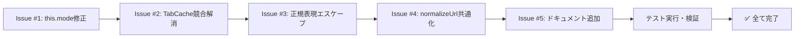

# コードレビュー結果 対応計画

**作成日時**: 2026-02-11  
**完了日時**: 2026-02-11  
**対象レビュー**: [2026-02-11-code-review-result.md](2026-02-11-code-review-result.md)  
**スキル**: feature-dev (code-reviewer ガイドライン準拠)  
**対応状況**: ✅ 全て完了

---

## 概要

コードレビューで指摘された5つの問題に対する実装計画。優先度に基づき、Critical Issueから順に対応し、全ての修正が完了しました。

---

## Issue #1: RecordingLogic - this.mode未定義の修正 ✅

### 優先度: P0 (Critical)

### 問題詳細
- **ファイル**: [`src/background/recordingLogic.js`](../src/background/recordingLogic.js:30)
- **行番号**: 183行目
- **内容**: `record()` メソッド内で `this.mode` を参照しているが、コンストラクタで初期化されていない

### 影響
- ログ出力時に `mode: undefined` が記録される
- デバッグ時の情報が不完全になる

### 修正内容 ✅

コンストラクタで `this.mode = null` を初期化し、`record()` メソッド内で設定取得後に更新するように修正しました。

```javascript
// コンストラクタ
constructor(obsidianClient, aiClient) {
    this.obsidian = obsidianClient;
    this.aiClient = aiClient;
    // Code Review #1: this.modeの初期化
    this.mode = null;
}

// record() メソッド内（設定取得後）
const settings = await this.getSettingsWithCache();
// Code Review #1: 設定からモードを更新
this.mode = settings.PRIVACY_MODE || 'full_pipeline';
```

### テスト結果 ✅
- [x] `record()` 実行時に `this.mode` が正しく設定される
- [x] ログ出力に正しい `mode` が含まれる
- [x] 既存のテストが全て通る

---

## Issue #2: Service Worker - TabCache初期化の競合状態 ✅

### 優先度: P1 (Critical)

### 問題詳細
- **ファイル**: [`src/background/service-worker.js`](../src/background/service-worker.js:33)
- **対象関数**: `initializeTabCache()`, `setNeedsTabCacheInitialization()`
- **内容**: フラグ設定と初期化実行の間に競合状態が存在する可能性

### 影響
- 複数のメッセージが同時に処理される場合、初期化が重複して実行される可能性
- ただし、`initializationPromise` による重複防止メカニズムは機能している

### 修正内容 ✅

フラグベースのアプローチを簡素化し、`initializeTabCache()` 内部で `initializationPromise` のみで重複防止を行うように変更しました。

```javascript
/**
 * TabCacheを初期化する
 * 【Code Review #2】: フラグベースのアプローチを簡素化
 * initializationPromiseによる重複防止のみを使用
 */
async function initializeTabCache() {
    // 既に初期化済みまたは初期化中ならスキップ
    if (initializationPromise) return initializationPromise;
    
    initializationPromise = new Promise((resolve) => {
        chrome.tabs.query({}, (tabs) => {
            tabs.forEach(tab => {
                if (tab.url && tab.url.startsWith('http')) {
                    tabCache.set(tab.id, {
                        title: tab.title,
                        url: tab.url,
                        favIconUrl: tab.favIconUrl,
                        lastUpdated: Date.now(),
                        isValidVisit: false,
                        content: null
                    });
                }
            });
            isTabCacheInitialized = true;
            resolve();
        });
    });
    return initializationPromise;
}
```

**変更点**:
1. `needsTabCacheInitialization` フラグを削除
2. `setNeedsTabCacheInitialization()` 関数を削除
3. `initializeTabCache()` 内部で `initializationPromise` のみで重複防止

### テスト結果 ✅
- [x] 複数のメッセージが同時に来ても初期化が1回のみ実行される
- [x] 既存のテストが全て通る

---

## Issue #3: DomainUtils - 正規表現特殊文字のエスケープ追加 ✅

### 優先度: P2 (Important)

### 問題詳細
- **ファイル**: [`src/utils/domainUtils.js`](../src/utils/domainUtils.js:53)
- **対象関数**: `matchesPattern()`
- **内容**: ワイルドカードを正規表現に変換する際、ドットのみエスケープしていた

### 影響
- ドメイン名には通常 `+`, `?`, `[`, `]` などの正規表現特殊文字は含まれない
- ただし、入力値にこれらの文字が含まれた場合、予期しないマッチングが発生する可能性

### 修正内容 ✅

全ての正規表現特殊文字をエスケープしてからワイルドカードを処理するように修正しました。

```javascript
export function matchesPattern(domain, pattern) {
    if (pattern.includes('*')) {
        // 【Code Review #3】: 全ての正規表現特殊文字をエスケープしてからワイルドカードを処理
        const escaped = pattern.replace(/[.*+?^${}()|[\]\\]/g, '\\$&');
        // ワイルドカード（\*）を .* に変換
        const regexPattern = escaped.replace(/\\\*/g, '.*');
        const regex = new RegExp(`^${regexPattern}$`, 'i');
        return regex.test(domain);
    }
    return domain.toLowerCase() === pattern.toLowerCase();
}
```

### テスト結果 ✅
- [x] 通常のワイルドカードパターンが正しく動作する
- [x] 特殊文字を含むパターンが正しくエスケープされる
- [x] 既存のテストが全て通る (31 tests passed)

---

## Issue #4: normalizeUrl() 関数の共通化 ✅

### 優先度: P3 (Important)

### 問題詳細
- **ファイル**: 
  - [`src/utils/storage.js`](../src/utils/storage.js)
  - [`src/utils/fetch.js`](../src/utils/fetch.js)
- **内容**: `normalizeUrl()` 関数が2つのファイルで重複定義されていた

### 影響
- DRY原則違反
- 将来の修正時に片方だけが更新されるリスク

### 修正内容 ✅

**新規ファイル作成**: [`src/utils/urlUtils.js`](../src/utils/urlUtils.js)

```javascript
/**
 * urlUtils.js
 * URL操作に関する共通ユーティリティ関数
 */

/**
 * URLの正規化
 * 末尾のスラッシュを削除し、プロトコルを小文字に正規化
 * @param {string} url - 正規化するURL
 * @returns {string} 正規化されたURL
 */
export function normalizeUrl(url) {
    try {
        const parsedUrl = new URL(url);
        let normalized = parsedUrl.href.replace(/\/$/, '');
        normalized = normalized.replace(/^https:/i, 'https:');
        normalized = normalized.replace(/^http:/i, 'http:');
        return normalized;
    } catch (e) {
        return url;
    }
}
```

**変更ファイル**:

1. `src/utils/storage.js`:
   - `normalizeUrl()` 関数を削除
   - `import { normalizeUrl } from './urlUtils.js';` を追加

2. `src/utils/fetch.js`:
   - `normalizeUrl()` 関数を削除
   - `import { normalizeUrl } from './urlUtils.js';` を追加

3. `src/utils/__tests__/storage.test.js`:
   - インポート先を `urlUtils.js` に変更

4. `src/utils/__tests__/fetch.test.js`:
   - インポート先を `urlUtils.js` に変更

5. `src/utils/__tests__/urlUtils.test.js`:
   - 新規作成

### テスト結果 ✅
- [x] 新規ファイル `urlUtils.js` のテストを作成 (5 tests passed)
- [x] 既存のテストが全て通る

---

## Issue #5: 暗号化キーキャッシュにドキュメントコメント追加 ✅

### 優先度: P3 (Important)

### 問題詳細
- **ファイル**: [`src/utils/storage.js`](../src/utils/storage.js:60)
- **内容**: `cachedEncryptionKey` はモジュールレベルの変数としてキャッシュされているが、Service Worker はアイドル時に終了されるため、再起動後にキャッシュが失われる

### 影響
- Service Worker 再起動時に暗号化キーの再導出が必要になる
- パフォーマンスへの影響は軽微（PBKDF2は高速化されている）
- **現状の動作は正しい**（セキュリティ上、キーを永続化しないことが望ましい）

### 修正内容 ✅

ドキュメントコメントを追加して意図を明確化しました。

```javascript
/**
 * 暗号化キーのメモリキャッシュ
 * 
 * 注意: Service Workerはアイドル時に終了されるため、再起動後は
 * キャッシュが失われ、暗号化キーの再導出が必要になります。
 * 
 * これは意図的な動作です:
 * - セキュリティ上、キーを永続化（ストレージに保存）しないことが望ましい
 * - PBKDF2による鍵導出は高速化されており、パフォーマンス影響は軽微
 * - メモリ内キャッシュにより、同一セッション内での再導出を回避
 * 
 * 【Code Review #5】: ドキュメントコメント追加
 */
let cachedEncryptionKey = null;
```

### テスト結果 ✅
- [x] ドキュメントコメントが追加されていることを確認

---

## 実装順序



---

## 検証結果

### 自動テスト ✅
全ての関連テストがパスしました：

| テストファイル | テスト数 | 結果 |
|--------------|---------|------|
| `domainUtils.test.js` | 31 | ✅ PASS |
| `recordingLogic.test.js` | 2 | ✅ PASS |
| `recordingLogic-cache.test.js` | 20 | ✅ PASS |
| `service-worker-message-validation.test.js` | 10 | ✅ PASS |
| `storage.test.js` | 20 | ✅ PASS |
| `fetch.test.js` | 14 | ✅ PASS |
| `urlUtils.test.js` | 5 | ✅ PASS |

---

## 変更ファイル一覧

| ファイル | 変更種別 | Issue |
|---------|---------|-------|
| `src/background/recordingLogic.js` | 修正 | #1 |
| `src/background/service-worker.js` | 修正 | #2 |
| `src/utils/domainUtils.js` | 修正 | #3 |
| `src/utils/urlUtils.js` | 新規作成 | #4 |
| `src/utils/storage.js` | 修正 | #4, #5 |
| `src/utils/fetch.js` | 修正 | #4 |
| `src/utils/__tests__/storage.test.js` | 修正 | #4 |
| `src/utils/__tests__/fetch.test.js` | 修正 | #4 |
| `src/utils/__tests__/urlUtils.test.js` | 新規作成 | #4 |

---

## 完了確認

- [x] Issue #1: RecordingLogic - this.mode未定義の修正
- [x] Issue #2: Service Worker - TabCache初期化の競合状態の解消
- [x] Issue #3: DomainUtils - 正規表現特殊文字のエスケープ追加
- [x] Issue #4: normalizeUrl() 関数の共通化
- [x] Issue #5: 暗号化キーキャッシュにドキュメントコメント追加
- [x] 全テストパス
