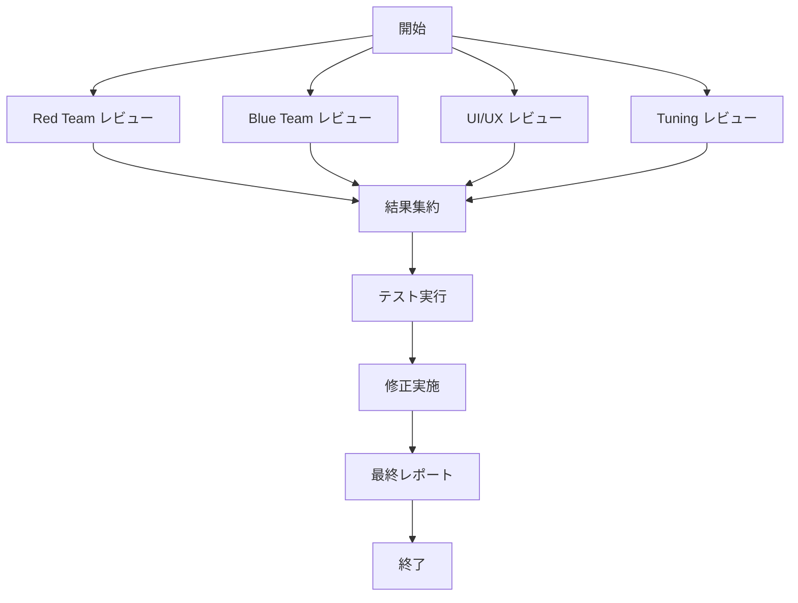

# Checking Team レビュー計画

## 概要

このドキュメントは、Obsidian Smart History Chrome拡張機能に対する包括的なプロジェクトレビューの計画です。
checking-team スキルのアプローチに基づき、4つの専門的観点からレビューを実施します。

## プロジェクト概要

| 項目 | 詳細 |
|------|------|
| プロジェクト名 | Obsidian Smart History |
| バージョン | 3.0.3 (manifest) / 3.0.0 (package) |
| タイプ | Chrome Extension (Manifest V3) |
| 主な機能 | 閉じたタブをObsidianにAI要約付きでバックアップ |

### アーキテクチャ

```
┌─────────────────────────────────────────────────────────────┐
│                    Chrome Extension                          │
├─────────────────────────────────────────────────────────────┤
│  Popup UI (popup/)                                          │
│  ├── popup.html/ts - メインUI                               │
│  ├── domainFilter.ts - ドメインフィルタ設定                  │
│  ├── navigation.ts - タブ管理                                │
│  └── ublockImport/ - uBlockフィルタインポート                │
├─────────────────────────────────────────────────────────────┤
│  Service Worker (background/)                               │
│  ├── service-worker.ts - メインエントリ                      │
│  ├── aiClient.ts - AI API クライアント                       │
│  ├── obsidianClient.ts - Obsidian REST API クライアント      │
│  ├── recordingLogic.ts - 記録ロジック                        │
│  └── ai/providers/ - AIプロバイダー実装                      │
├─────────────────────────────────────────────────────────────┤
│  Content Script (content/)                                  │
│  └── extractor.ts - ページコンテンツ抽出                     │
├─────────────────────────────────────────────────────────────┤
│  Utilities (utils/)                                         │
│  ├── storage.ts - Chrome Storage ラッパー                    │
│  ├── crypto.ts - 暗号化ユーティリティ                        │
│  ├── piiSanitizer.ts - PII マスキング                        │
│  └── ublockParser/ - uBlockフィルタパーサー                  │
└─────────────────────────────────────────────────────────────┘
```

---

## 1. Red Team レビュー計画

### 目的
攻撃的観点から潜在的な脆弱性と悪用可能な点を特定する。

### レビュー対象ファイル

| ファイル | 理由 |
|----------|------|
| [`src/background/aiClient.ts`](src/background/aiClient.ts) | 外部API通信、APIキー処理 |
| [`src/background/obsidianClient.ts`](src/background/obsidianClient.ts) | 外部API通信、URL検証 |
| [`src/content/extractor.ts`](src/content/extractor.ts) | 全URLで動作、DOM操作 |
| [`src/utils/piiSanitizer.ts`](src/utils/piiSanitizer.ts) | 正規表現ベース処理 |
| [`src/popup/popup.ts`](src/popup/popup.ts) | ユーザー入力処理 |
| [`src/utils/storage.ts`](src/utils/storage.ts) | 機密データ保存 |

### チェック項目

#### OWASP Top 10 対応
- [ ] **インジェクション攻撃**
  - promptSanitizer.ts でのプロンプトインジェクション対策確認
  - markdownSanitizer.ts でのXSS対策確認
  - pathSanitizer.ts でのパストラバーサル対策確認

- [ ] **認証の不備**
  - APIキー保存・使用方法の確認
  - crypto.ts での暗号化実装確認

- [ ] **XSS（クロスサイトスクリプティング）**
  - popup.ts での innerHTML 使用確認
  - sanitizePreview.ts でのサニタイズ確認
  - ublockImport/ でのファイルインポート処理

- [ ] **機密データの露出**
  - ログ出力でのAPIキー露出確認
  - エラーメッセージでの機密情報露出確認

#### Chrome拡張特有のリスク
- [ ] Content Script Injection（全URLで動作）
- [ ] chrome.storage への機密データ保存
- [ ] host_permissions の範囲
- [ ] Service Worker のライフサイクル問題

#### 正規表現の脆弱性
- [ ] piiSanitizer.ts でのReDoS脆弱性
- [ ] ublockParser/ での正規表現パフォーマンス

---

## 2. Blue Team レビュー計画

### 目的
防御的観点からシステムの安全性と堅牢性を検証する。

### レビュー対象ファイル

| ファイル | 理由 |
|----------|------|
| [`src/utils/crypto.ts`](src/utils/crypto.ts) | 暗号化実装 |
| [`src/utils/urlUtils.ts`](src/utils/urlUtils.ts) | URL検証 |
| [`src/utils/fetch.ts`](src/utils/fetch.ts) | ネットワークリクエスト |
| [`src/background/Mutex.ts`](src/background/Mutex.ts) | 並行処理制御 |
| [`src/utils/retryHelper.ts`](src/utils/retryHelper.ts) | エラーハンドリング |

### チェック項目

#### 入力バリデーション
- [ ] ユーザー入力がバリデーションされている
- [ ] 型チェック実装
- [ ] 長さ/範囲チェック
- [ ] 特殊文字処理

#### 認証・認可
- [ ] APIキーの適切な管理
- [ ] トークン有効期限管理
- [ ] 権限チェック実装

#### エラーハンドリング
- [ ] 例外が適切にキャッチされている
- [ ] エラー情報が過度に露出していない
- [ ] ログに機密情報が含まれていない

#### 依存関係
- [ ] 依存パッケージの脆弱性確認（npm audit）
- [ ] 不要な依存関係の確認

#### 環境設定
- [ ] CSP設定の適切性
- [ ] 機密情報がハードコードされていない
- [ ] manifest.json の権限設定

---

## 3. UI/UX エキスパート レビュー計画

### 目的
ユーザー体験とインターフェースデザインの質を評価する。

### レビュー対象ファイル

| ファイル | 理由 |
|----------|------|
| [`src/popup/popup.html`](src/popup/popup.html) | メインUI構造 |
| [`src/popup/styles.css`](src/popup/styles.css) | スタイリング |
| [`src/popup/navigation.ts`](src/popup/navigation.ts) | ナビゲーション |
| [`src/popup/spinner.ts`](src/popup/spinner.ts) | ローディング表示 |
| [`src/popup/utils/focusTrap.ts`](src/popup/utils/focusTrap.ts) | アクセシビリティ |

### チェック項目

#### ユーザビリティ
- [ ] ユーザー操作フローが直感的
- [ ] 必要な操作が簡潔
- [ ] エラーメッセージが明確
- [ ] システム状態が視覚的に伝わる

#### アクセシビリティ（WCAG 2.1 Level AA）
- [ ] キーボードナビゲーション可能
- [ ] スクリーンリーダー対応（aria属性）
- [ ] コントラスト比適切
- [ ] フォーカスインジケーター表示
- [ ] data-i18n 属性による国際化

#### 一貫性
- [ ] UI コンポーネントの一貫使用
- [ ] 用語の統一
- [ ] レイアウトの一貫性
- [ ] インタラクションの挙動統一

#### レスポンシブ
- [ ] ポップアップサイズ対応
- [ ] コンテンツオーバーフロー対応

---

## 4. Tuning エキスパート レビュー計画

### 目的
システムのパフォーマンスとリソース効率を評価・最適化する。

### レビュー対象ファイル

| ファイル | 理由 |
|----------|------|
| [`src/background/tabCache.ts`](src/background/tabCache.ts) | キャッシング実装 |
| [`src/utils/ublockParser/cache.ts`](src/utils/ublockParser/cache.ts) | パーサーキャッシュ |
| [`src/background/recordingLogic.ts`](src/background/recordingLogic.ts) | メイン処理フロー |
| [`src/content/extractor.ts`](src/content/extractor.ts) | DOM操作パフォーマンス |

### チェック項目

#### 実行パフォーマンス
- [ ] ボトルネック特定（CPU, I/O, ネットワーク）
- [ ] 遅延の原因特定
- [ ] 最適化可能なアルゴリズム

#### リソース使用
- [ ] メモリ使用量適切
- [ ] メモリリークなし
- [ ] ネットワーク呼び出し最小化

#### キャッシング
- [ ] キャッシング戦略適切
- [ ] キャッシュ無効化戦略
- [ ] Service Worker ライフサイクル対応

#### 並列処理
- [ ] 非同期処理活用
- [ ] Mutex の適切な使用
- [ ] デッドロック/競合条件なし

---

## 5. テスト実行計画

### 単体テスト
```bash
npm test              # 全テスト実行
npm run test:coverage # カバレッジレポート生成
```

### テストカバレッジ目標
- 重要モジュール: 80%以上
- ユーティリティ: 70%以上

### テスト種類

| 種類 | 対象 | 実行コマンド |
|------|------|--------------|
| 単体テスト | 全モジュール | `npm test` |
| 型チェック | TypeScript | `npm run type-check` |
| セキュリティ監査 | 依存関係 | `npm audit` |

### 手動テスト項目
- [ ] Chrome拡張としてのロード確認
- [ ] ポップアップUIの動作確認
- [ ] Obsidian連携の動作確認
- [ ] AI API連携の動作確認

---

## 実行スケジュール



---

## 成果物

1. **レビューレポート** - 各専門家の発見事項
2. **修正プルリクエスト** - 実施した修正
3. **サマリーレポート** - 全体の品質状況

---

## 参照ドキュメント

- [AGENTS.md](AGENTS.md) - プロジェクト固有のガイドライン
- [docs/DESIGN_SPECIFICATIONS.md](docs/DESIGN_SPECIFICATIONS.md) - 設計仕様
- [docs/ACCESSIBILITY.md](docs/ACCESSIBILITY.md) - アクセシビリティガイド
- [CONTRIBUTING.md](CONTRIBUTING.md) - 開発ガイド
